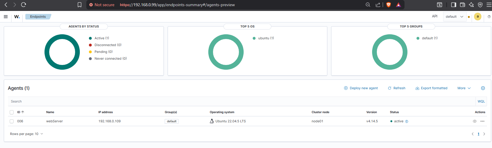
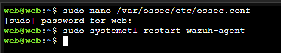
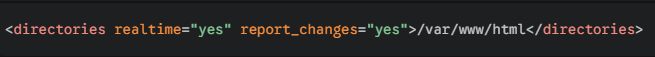
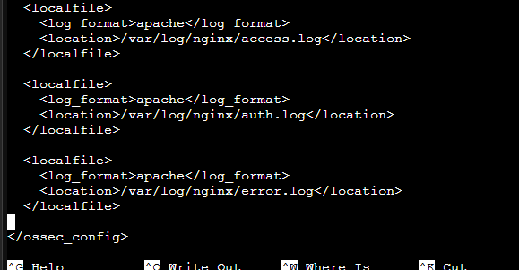
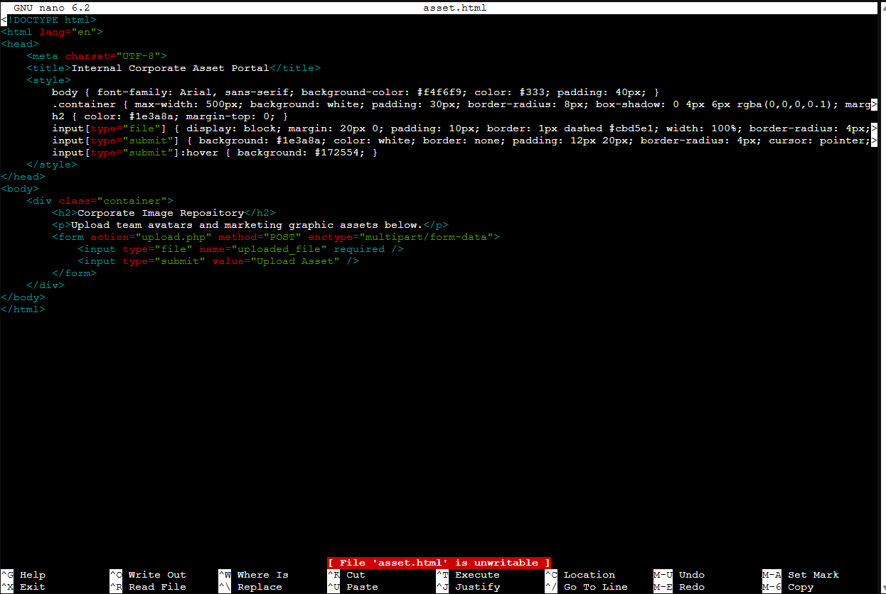
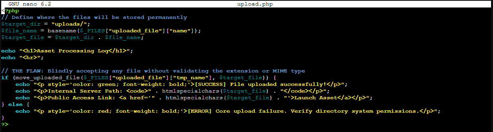

# Infrastructure Preparation & Telemetry Configuration

This document outlines the preparation of the Ubuntu web server and the integration of telemetry pipelines required for centralized security monitoring within the DFIR laboratory environment.

---

# 1. Web Server Preparation

The Ubuntu host was configured with the Nginx web server to simulate a realistic public-facing application stack. Logging and filesystem permissions were hardened to ensure accurate event generation and reliable forensic visibility during attack simulation exercises.

---

# 2. Filesystem Permission Hardening

To ensure stable web service operation and proper ownership alignment with the web process account (`www-data`), the web directory permissions were standardized using Linux access controls.

## Commands Executed

```bash
sudo chown -R www-data:www-data /var/www/html
sudo chmod -R 755 /var/www/html
```

## Security Purpose

| Control | Purpose |
|---|---|
| `chown` | Assigns ownership to the Nginx/PHP service account |
| `chmod 755` | Prevents unauthorized write access while preserving web readability |

This ensures:
- controlled file modification behavior
- predictable forensic attribution
- reduced risk of accidental permission escalation

---

# 3. Wazuh Agent Integration

The Ubuntu host was onboarded into the centralized SIEM infrastructure using the Wazuh Agent.

The agent continuously monitors:
- filesystem changes
- authentication activity
- web server telemetry
- application log streams

Telemetry generated locally is forwarded to the Wazuh Manager for:
- alert correlation
- rule matching
- incident visualization
- forensic investigation


---

# 4. Wazuh Agent Configuration (`ossec.conf`)

By default, the Wazuh Agent does not automatically ingest third-party application telemetry such as Nginx logs. Manual configuration was required to extend monitoring visibility into the web application layer.

## Configuration File

```bash
sudo nano /var/ossec/etc/ossec.conf
```



The following monitoring blocks were added before the closing `</ossec_config>` tag.

---

## Real-Time File Integrity Monitoring (FIM)

```xml
<directories realtime="yes" report_changes="yes">/var/www/html</directories>
```



### Purpose
Enables real-time monitoring of the web root directory to detect:
- unauthorized uploads
- malicious file creation
- web shell deployment
- unexpected content modification

---

## Nginx Access Log Monitoring

```xml
<localfile>
  <log_format>apache</log_format>
  <location>/var/log/nginx/access.log</location>
</localfile>
```

### Purpose
Captures:
- inbound requests
- suspicious query parameters
- scanning activity
- command injection attempts
- attacker IP addresses

---

## Nginx Error Log Monitoring

```xml
<localfile>
  <log_format>nginxlog</log_format>
  <location>/var/log/nginx/error.log</location>
</localfile>
```

### Purpose
Provides visibility into:
- directory brute forcing
- missing resource enumeration
- failed exploit attempts
- abnormal application behavior

---

## Linux Authentication Log Monitoring

```xml
<localfile>
  <log_format>syslog</log_format>
  <location>/var/log/auth.log</location>
</localfile>
```

### Purpose
Detects:
- failed SSH logins
- brute force attempts
- invalid users
- authentication anomalies
- privilege escalation activity



---

# 5. Applying Configuration Changes

After modifying the agent configuration, the Wazuh service was restarted to activate the telemetry pipeline.


---

## Custom Web Application Components

To support controlled attack simulation and forensic telemetry generation, a lightweight custom web application was developed using HTML and PHP. The frontend HTML interface provided a simple upload and interaction surface that emulated a realistic public-facing web portal, while the backend PHP logic handled server-side request processing and file operations.

The application was intentionally designed to generate observable security events within the monitoring environment, allowing the SIEM infrastructure to capture:
- inbound HTTP requests
- file upload activity
- abnormal query parameters
- authentication attempts
- application-layer anomalies

This custom-built implementation enabled direct visibility into how attacker interactions propagate through:
- the web server
- operating system logs
- File Integrity Monitoring (FIM)
- centralized SIEM alerting pipelines

By developing the PHP and HTML components manually rather than relying on prebuilt vulnerable applications, the laboratory environment remained lightweight, transparent, and fully controllable for DFIR-focused experimentation and detection engineering exercises.




