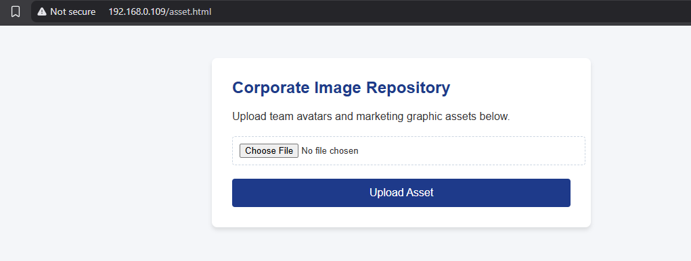
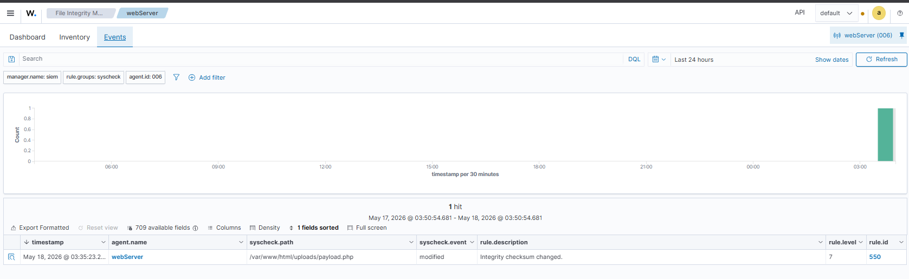

# Phase 2: Initial Access (Unrestricted File Upload)

This phase documents how a vulnerable file upload mechanism was leveraged to place unauthorized server-side content onto the Ubuntu web server, establishing initial foothold capability within the environment.

---

# Attack Objective

The attacker aimed to abuse insecure file upload handling to introduce unauthorized executable content into the web application directory structure.

This activity simulates a common real-world web application weakness where uploaded files are not properly validated before being written to disk.

---

# Attack Procedure

The attacker interacted with the public-facing upload functionality exposed by the custom PHP application.

Instead of uploading an expected benign asset, a specially crafted server-side script was submitted through the application interface.

Due to missing upload validation controls, the backend application accepted the file and wrote it directly into the web-accessible uploads directory.


---

# Vulnerability Conditions

The following security weaknesses enabled successful exploitation:

| Weakness | Impact |
|---|---|
| Missing file extension validation | Arbitrary file upload permitted |
| No MIME-type verification | Executable content accepted |
| Web-accessible upload directory | Uploaded content became remotely reachable |
| Insufficient server-side filtering | Malicious payload bypassed controls |


---

# File Placement Artifact

The uploaded file was written into the following monitored directory:

```text
/var/www/html/uploads/
```

Because this directory was actively monitored by the Wazuh File Integrity Monitoring (FIM) engine, the file creation event generated immediate forensic telemetry.


---
